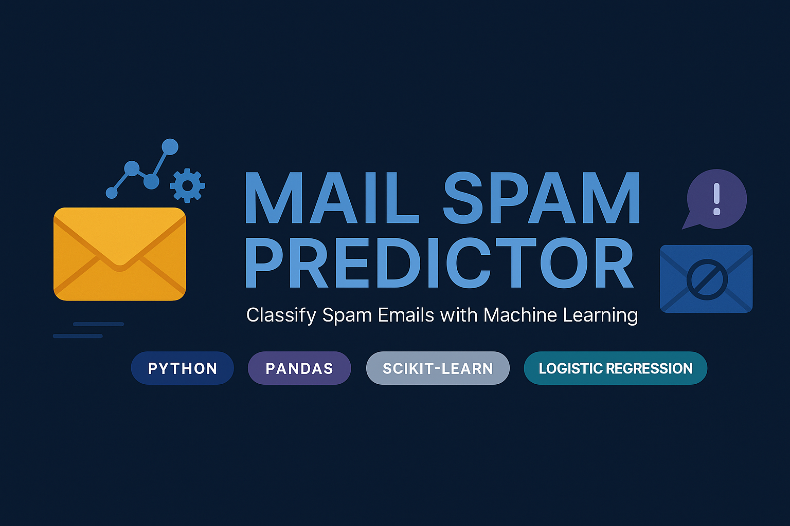

✉️ Mail Spam Predictor

  

A complete, end-to-end machine learning pipeline for classifying SMS/email messages as spam or ham.
Built using Python, Pandas, TF-IDF vectorization, and Logistic Regression, this project demonstrates the essential workflow behind classical NLP-based text classification.

Clean preprocessing.
Structured feature engineering.
Reliable, explainable modeling.

📌 Project Overview

Spam detection is one of the most practical and widely deployed NLP applications.
This project uses a dataset of 5,572 text messages and applies:

Text cleaning

Label encoding

TF-IDF feature extraction

Train/test split

Logistic Regression training

Model evaluation

Model export (.pkl)

Everything is implemented in a single, clear Jupyter/Colab Notebook:

Mail_Spam_Predictor.ipynb

🧠 Key Features

Converts raw SMS/email text into numerical vectors using TF-IDF

Classifies messages as spam or ham

Achieves strong generalization (~96% accuracy)

Saves trained model + vectorizer for reuse

Beginner-friendly, industry-aligned ML workflow

Cleanly written, reproducible, minimal dependencies

📂 Repository Structure
📦 Mail-Spam-Predictor
│
├── Mail_Spam_Predictor.ipynb      # Full ML workflow
├── mail_data.csv                  # Dataset (optional)
│
└── model/
    ├── model.pkl                  # Trained classifier
    └── vect.pkl                   # TF-IDF vectorizer

⚙️ How the System Works
1️⃣ Importing Dependencies

The notebook loads NumPy, Pandas, scikit-learn, and joblib to handle data, NLP, and modeling.

2️⃣ Data Loading & Cleaning

Load the dataset

Replace null values with empty strings

Inspect sample messages

Normalize category labels (spam, ham)

3️⃣ Label Encoding
ham  → 0  
spam → 1

This converts categories into a clean binary form.

4️⃣ Train/Test Split

The dataset is split:

80% → training

20% → testing

This allows unbiased evaluation.

5️⃣ TF-IDF Feature Extraction

Text is mapped into numerical space using:

TfidfVectorizer(min_df=1, stop_words='english', lowercase=True)

TF-IDF preserves:

important words

relative importance

sparsity of message patterns

6️⃣ Logistic Regression Model

A classical, effective approach for high-dimensional sparse text.

The notebook trains a classifier that separates spam-like word patterns from normal conversation.

7️⃣ Accuracy Evaluation

Training Accuracy: ~96.7%
Testing Accuracy: ~96.8%

A strong signal with minimal overfitting.

8️⃣ Model Export

Both the trained classifier and vectorizer are saved:

model/model.pkl
model/vect.pkl

These can be loaded anywhere for predictions.

🚀 Prediction Example
import joblib

model = joblib.load("model/model.pkl")
vectorizer = joblib.load("model/vect.pkl")

msg = ["Congratulations! You won a free ticket. Claim now!"]
features = vectorizer.transform(msg)

print(model.predict(features))   # Output: 1 (spam)

🔧 Installation & Usage
Install requirements
pip install -r requirements.txt

Run notebook

Open:

Mail_Spam_Predictor.ipynb

Run cells → view outputs → generate predictions.

🌈 Tech Stack

Python

NumPy

Pandas

Scikit-Learn

Joblib

Colab / Jupyter Notebook

🧩 Ideal For

ML students

NLP beginners

Academic assignments

Portfolio projects

Real-world spam detection demos

Understanding classical ML models with text

🧑‍💻 Author

Rumaisa Fatima
Machine Learning Enthusiast • Full Stack Developer

🌐 GitHub: https://github.com/rumaisafatima

💡 "Models learn patterns. Engineers learn why the patterns matter."

  
     

  

Crafted with clarity. Designed with purpose.
Spam filtered with intelligence.

